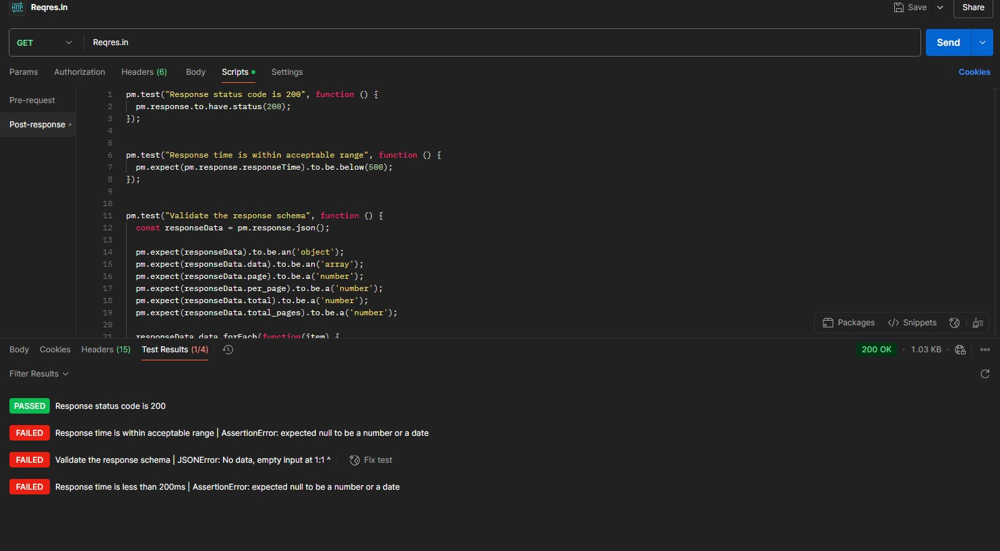

# API Testing with Postman  

**Как запустить тесты:**  
1. Установите Postman.  
2. Импортируйте коллекцию `Reqres_API_Tests.postman_collection.json`.  
3. Нажмите "Run" для выполнения тестов.  

**Пример успешного теста:**  
  